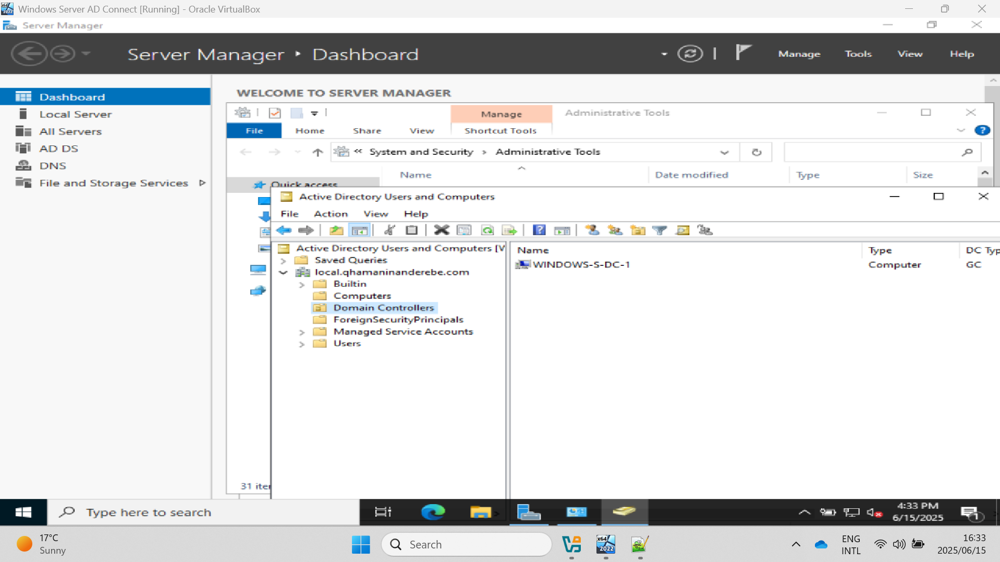
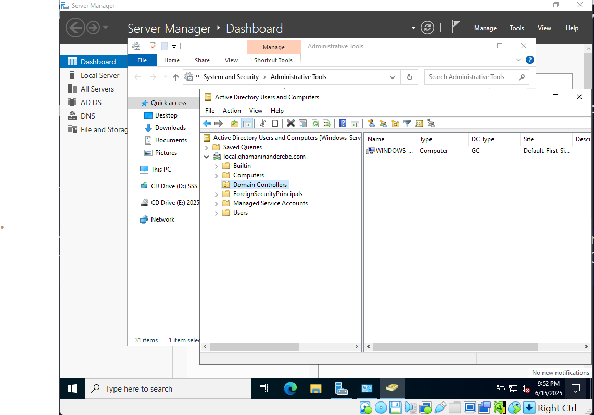

# AD-Domain-Join-Lab

# 🖧 Active Directory Domain Join Lab

This lab demonstrates the setup of a Windows Server as a Domain Controller (DC) and joining client machines to that domain. It also includes enabling ICMP (ping) traffic from the DC to domain-joined clients—a common requirement for network diagnostics in real-world environments.

---

## 🧠 What You’ll Learn

- Set up a Domain Controller with Active Directory Domain Services (AD DS)
- Configure static IP and DNS using loopback
- Promote the server to a DC
- Create Organizational Units (OUs) and users
- Join a client machine to the domain
- Enable ICMP traffic between Domain Controller and clients (for ping)

---

## 🔧 Lab Steps

1. **Set Static IP on the Server**
2. **Configure Loopback DNS on the Server**
3. **Install Active Directory Domain Services (AD DS) Role**
4. **Promote the Server to a Domain Controller**
5. **Create and Configure a Domain**
6. **Verify DNS Configuration**
7. **Create OUs and Domain Users**
8. **Set DNS on Client Machine**
9. **Join the Client to the Domain**
10. **Enable ICMP Rule in Windows Firewall (Clients)** ✅

---

## 🛡️ Enabling ICMP (Ping) on Domain-Joined Clients

## 🖼️ Screenshots

| Step | Description | Screenshot |
|------|-------------|------------|
| 1 | Set static IP address |  |
| 2 | Configure loopback DNS |  |
| 3 | Install AD DS role |  |
| 4 | Promote server to DC |  |
| 5 | Create domain |  |
| 6 | Verify DNS |  |
| 7 | Create OU & user |  |
| 8 | Set DNS on client |  |
| 9 | Join domain success |  |
To allow the Domain Controller to ping the clients:
```powershell
Enable-NetFirewallRule -DisplayName "File and Printer Sharing (Echo Request - ICMPv4-In)"

## 🖼️ Screenshots

| Step | Description | Screenshot |
|------|-------------|------------|
| 1 | Set static IP address |  |
| 2 | Configure loopback DNS |  |
| 3 | Install AD DS role |  |
| 4 | Promote server to DC |  |
| 5 | Create domain |  |
| 6 | Verify DNS |  |
| 7 | Create OU & user |  |
| 8 | Set DNS on client |  |
| 9 | Join domain success |  |

---

## 📘 Notes

- The DNS IP on all client machines should point to the Domain Controller’s IP to ensure proper domain name resolution.
- Loopback (127.0.0.1) DNS on the DC allows it to resolve its own domain queries.

---

## 📣 Motivation

> Building a Windows Server domain lab has given me hands-on experience with how enterprise environments manage identity, authentication, and networking. Step by step, the pieces come together—and documenting them makes the process even clearer.
